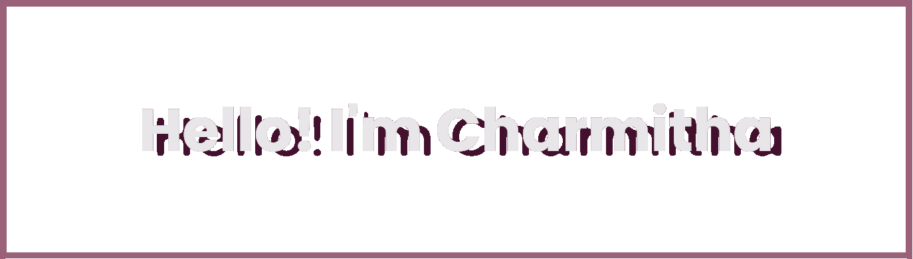

                                                        About Me: 

Hello, I'm Charmitha Garugu, a senior Computer Science Engineering Student with a knack for fusing technology, design, and management. My journey has been a blend of leadership, creativity, and code as I prepare to enter my new career.From aesthetics to algorithms, I've enjoyed the challenge of fusing coding and design to produce user-friendly and visually appealing digital experiences.

- 🔭 I’m currently working on ...
- 🌱 I’m currently learning ...
- 👯 I’m looking to collaborate on ...
- 🤔 I’m looking for help with ...
- 💬 Ask me about ...
- 📫 How to reach me: ...
- 😄 Pronouns: ...
- ⚡ Fun fact: ...

